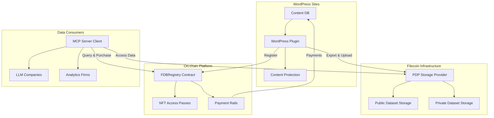
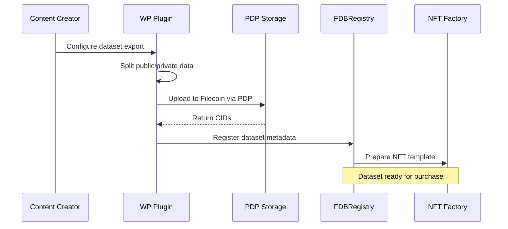
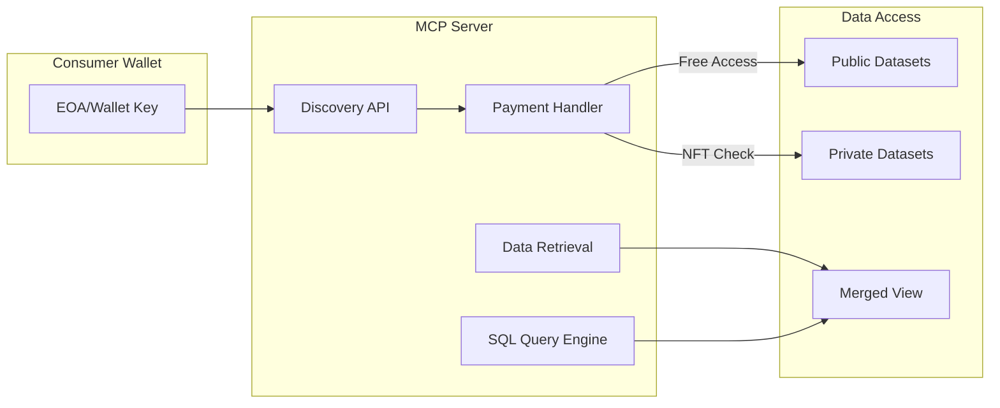
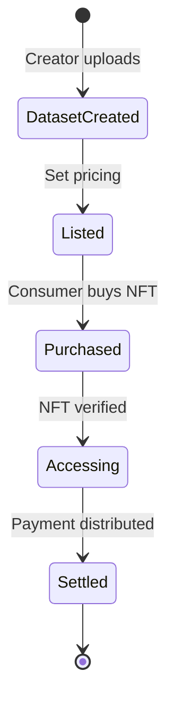
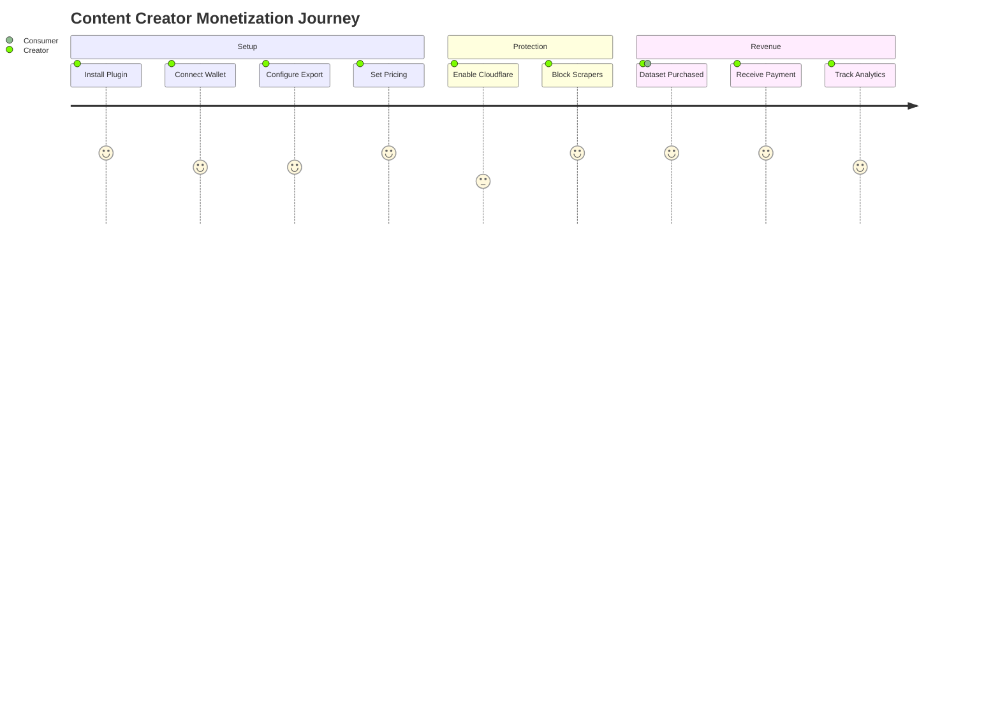
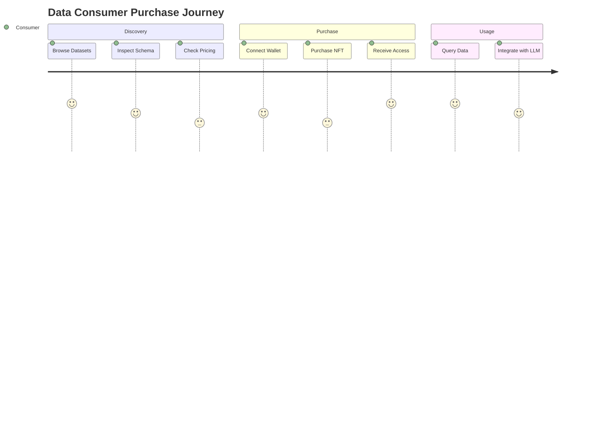
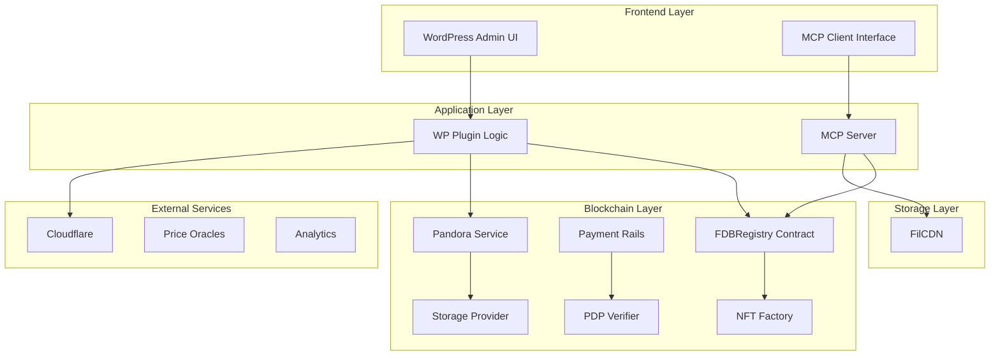
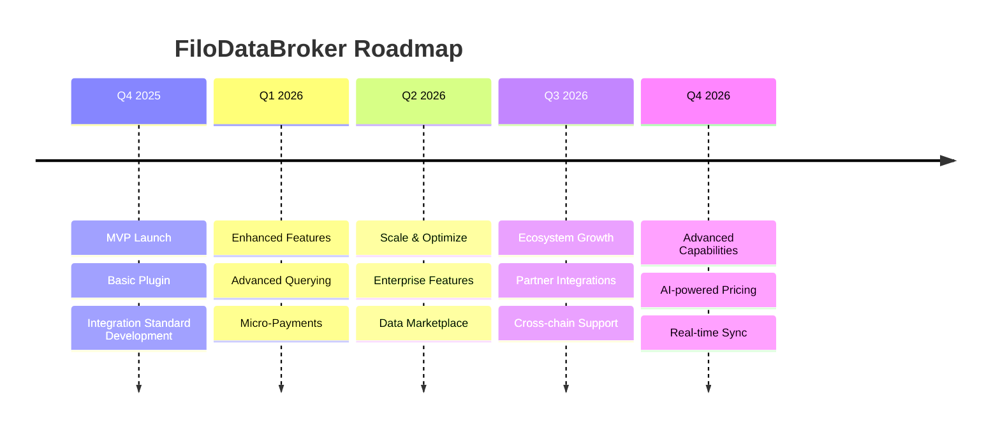

# FiloDataBroker: Product Design

## WordPress Content Monetization Platform for AI/LLM Use

### 1. Executive Summary

FiloDataBroker is a decentralized platform that empowers WordPress content creators to directly monetize their content for LLM training, analytics, and other data consumers. The platform leverages Filecoin's Proof of Data Possession (PDP) for verifiable hot storage and smart contracts for transparent payment rails, creating a legitimate marketplace for high-quality, schema-rich datasets.

### 2. Problem Statement

Content creators currently face several critical challenges:

- **Lost Monetization**: Content is scraped by bots for LLM training without compensation
- **No Control**: Creators cannot define what data is public vs. private or set access pricing
- **Black Market Data**: Middlemen profit from selling scraped datasets, often breaching copyright
- **Compliance Risks**: LLMs lack reliable proof of licensing/content rights
- **Technical Barriers**: Non-technical creators have no tools to reach data buyers or defend against scraping

### 3. Solution Overview

FiloDataBroker provides a complete ecosystem for legitimate data monetization:

### 4. Target Users

| User Type            | Persona                                          | Key Needs                                                      |
| -------------------- | ------------------------------------------------ | -------------------------------------------------------------- |
| **Content Creators** | WordPress site owners, bloggers, media companies | Passive monetization, data control, no-code tools              |
| **Data Consumers**   | LLM/AI companies, analytics firms, researchers   | Legitimate data access, high-quality datasets, API integration |
| **Developers**       | Platform engineers at LLM providers              | Broad content feeds, verifiable licensing, easy integration    |
| **Web3 Collectors**  | DePIN/DeSoc enthusiasts                          | Proof of access, support for content creators                  |

### 5. Core Features & Requirements

### 5.1 WordPress Plugin

#### Functional Requirements

- **Data Export Configuration**
  - No-code UI for selecting exportable content fields
  - Public/private field mapping interface
  - Support for posts, metadata, custom fields
  - Automated dataset splitting (public/private)
- **Pricing & Monetization**

  - Simple pricing interface per dataset
  - Recommended pricing suggestions based on content value
  - Support for one-time and subscription models
  - Revenue tracking dashboard

- **Content Protection Integration**
  - Recommended setup of WordPress plugins for effective blocking
  - Potential one-click Cloudflare integration

#### Technical Requirements

- Compatible with WordPress 5.0+
- PHP 7.4+ support
- No performance impact
- Secure wallet integration (MetaMask, WalletConnect)

### 5.2 On-chain Storage and Registry

#### Functional Requirements

- **Dataset Management**

  - Immutable dataset registration
  - Metadata storage (name, description, schema)
  - Version control for dataset updates
  - Public/private CID tracking

- **Access Control**
  - NFT-based access passes for private data
  - Time-limited access options
  - Transferable access rights

#### Technical Requirements

- Gas-optimized smart contracts
- Filecoin PDP integration for hot storage
- IPFS-compatible content addressing

### 5.3 MCP Server (Data Access Layer)

#### Functional Requirements

- **Dataset Discovery**

  - List available datasets with metadata
  - Search and filter capabilities
  - Schema inspection before purchase
  - Preview of public fields

- **Payment & Access**

  - Automated NFT minting on purchase
  - Wallet-based authentication
  - Proof of purchase verification
  - Access rights validation

- **Data Querying**
  - SQL interface via AlaSQL
  - In-memory data merging
  - Export to common formats (CSV, JSON)
  - Pagination for large datasets

#### Technical Requirements

- STDIO mode support for local operation
- <500ms query response time for 1GB datasets
- Support for concurrent queries
- Memory-efficient data handling

### 5.4 Payment Infrastructure

#### Functional Requirements

- **Payment Processing**
  - Smart contract-based escrow
  - Automatic creator payouts
  - Platform fee collection (2-5%)
  - Stablecoin support (USDFC)

#### Technical Requirements

- Integration with Filecoin payment rails
- Sub-second transaction confirmation
- Gas-optimized settlement
- Audit trail for all transactions

### 6. User Journeys

### 6.1 Creator Journey

### 6.2 Consumer Journey

### 7. Technical Architecture

### 8. Unique Filecoin Properties

FiloDataBroker leverages several unique Filecoin capabilities that are crucial for the project's success:

### 8.1 Data Availability Verification via PDP

- **Built-in Protocol Verification**: Filecoin's Proof of Data Possession (PDP) provides cryptographic guarantees that data is immediately available without requiring retrieval
- **Hot Storage Assurance**: Unlike traditional cold storage, PDP enables sub-second access to data while maintaining verifiable availability
- **Continuous Verification**: Automated daily challenges ensure data remains accessible throughout the storage period

### 8.2 Flexible Streaming Payment Infrastructure

- **Filecoin Pay Integration**: Native support for continuous, rate-based payments between creators and consumers
- **Lockup Mechanisms**: Guaranteed payment windows protect both parties with pre-funded lockups
- **Automatic Settlement**: Smart contract-based settlement removes payment friction and ensures timely compensation

### 8.3 Trustless On-chain Access Rights

- **ERC721 Token Standard**: NFT-based access passes provide immutable proof of data purchase rights
- **Decentralized Verification**: Access rights are verified on-chain without requiring trusted intermediaries
- **Transferable Ownership**: Data access rights can be traded or transferred, creating a secondary market for valuable datasets

### 9. MVP Scope

### Phase 0: Hackathon PoC (done)

- [x] Simple FDBRegistry smart contract
- [x] PDP storage integration
- [x] Basic NFT access control
- [x] MCP server with basic querying
- [x] NFT minting on purchase
- [x] Multi-dataset support
- [x] Payment rail integration
- [x] Private data encryption
- [x] FilCDN integration

### Phase 1: WordPress Plugin PoC (Weeks 1-2)

- [ ] Basic WordPress plugin with export functionality
- [ ] Simple admin UI with web3 wallet integration
- [ ] Guidelines for setting up other plugins for blocking AI crawlers
- [ ] Collect feedback & adjust next phases accordingly

### Phase 2: Data Access (Weeks 1-2)

- [ ] Datasets updating & versioning
- [ ] Analytics dashboard in WordPress plugin
- [ ] Remote querying capabilities via MCP server

### Phase 3: Monetization (Months 1-2)

- [ ] Web2 data marketplace for AI/LLM applications
- [ ] Standard for AI/LLM applications integration
- [ ] Secure micro-payments integration into the MCP server

### 10. Future Enhancements

### 11. Dependencies

- **External Dependencies**

  - Filecoin PDP mainnet stability
  - WordPress plugin approval
  - Cloudflare API availability
  - Web3 wallet adoption

- **Internal Dependencies**
  - Smart contract audits
  - Security reviews
  - Documentation completion
  - Community building

### 12. Open Questions

1. **Pricing Model**: Should we support dynamic pricing based on demand?
2. **Data Updates**: How to handle incremental updates to datasets?
3. **Privacy Compliance**: GDPR/CCPA implications for data export?
4. **Quality Assurance**: Automated vs. manual dataset verification?
5. **Network Effects**: Incentive mechanisms for early adopters?

### 13. Conclusion

FiloDataBroker represents a paradigm shift in content monetization, transforming WordPress sites from passive scraping victims into active participants in the data economy. By leveraging Filecoin's PDP for verifiable storage and smart contracts for transparent payments, we create a sustainable, legitimate marketplace that benefits both creators and consumers while maintaining the open nature of the web.
